In my spare time, I like painting and photography. I'll show some of my artwork on this page.

#### Paintings
Both original and reproduction works are listed here.

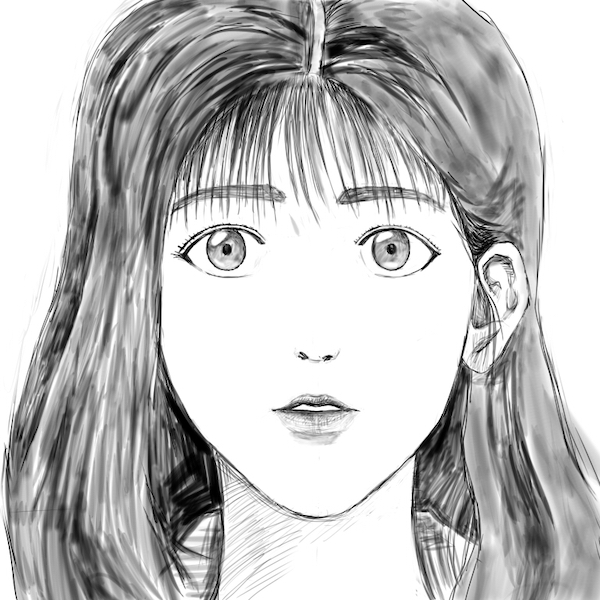

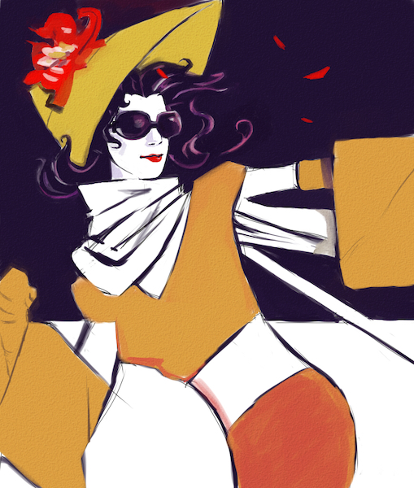
 
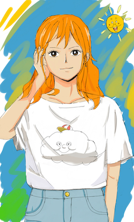

#### Photography
Photos shot on iPhone or SONY Alpha 6400.

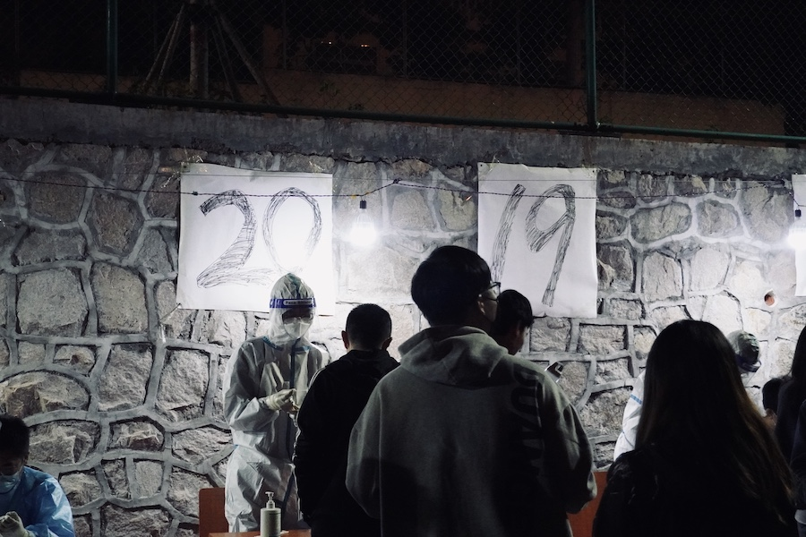
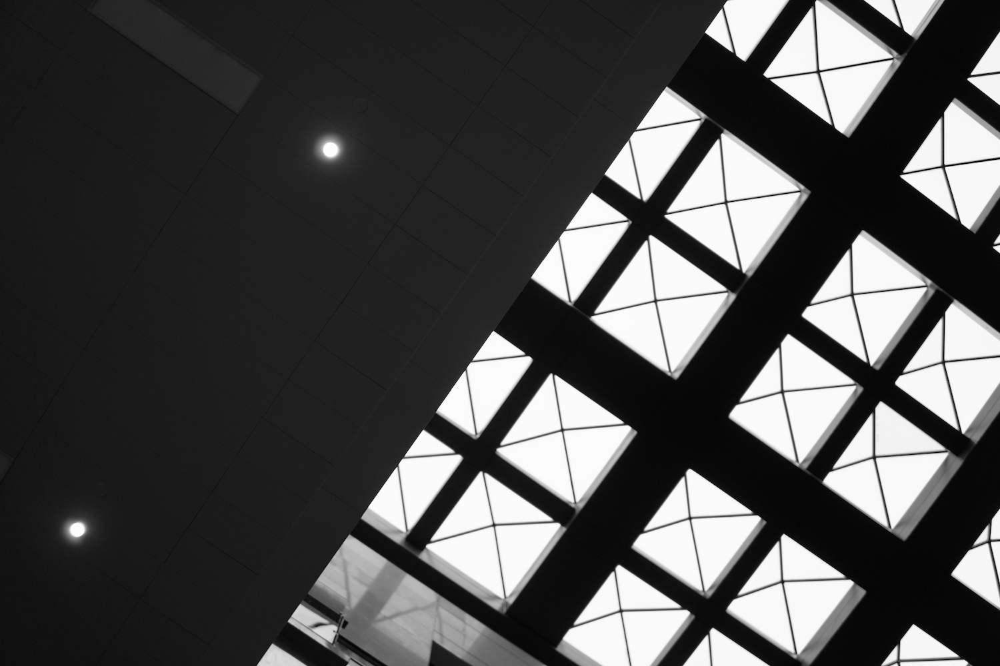
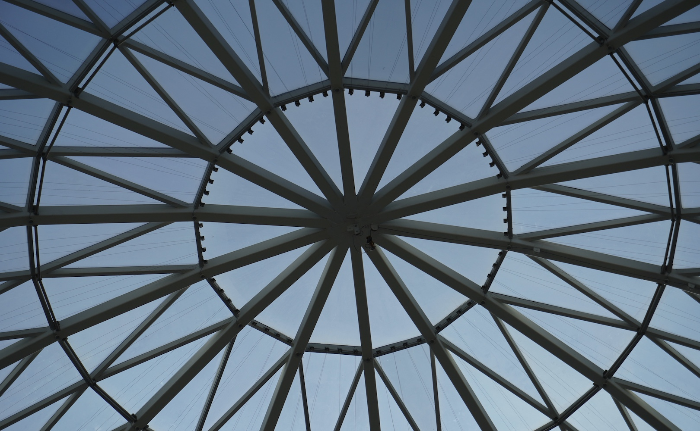
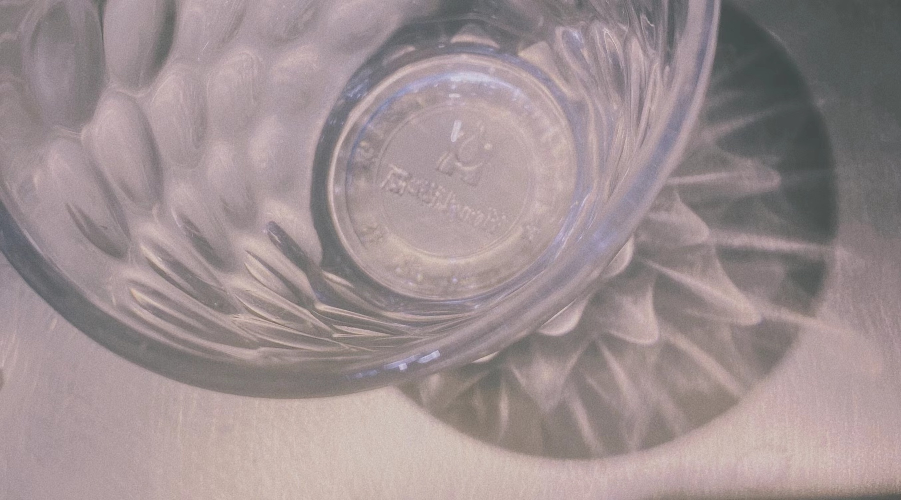
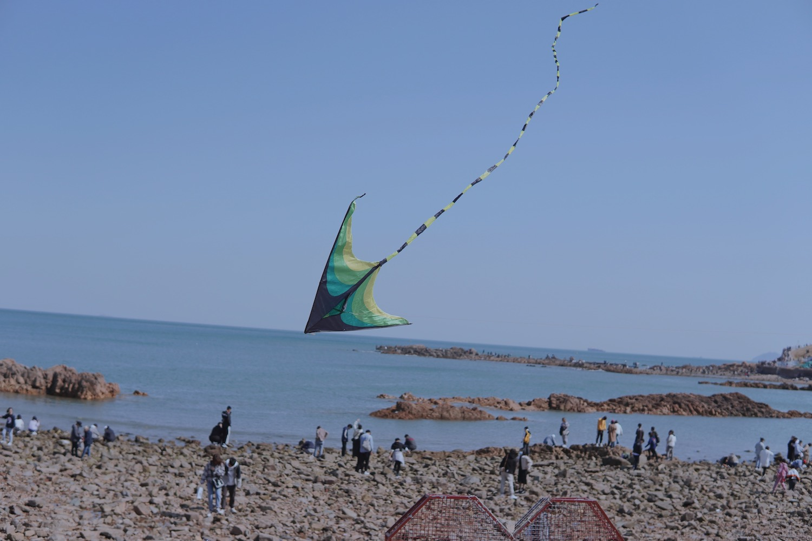
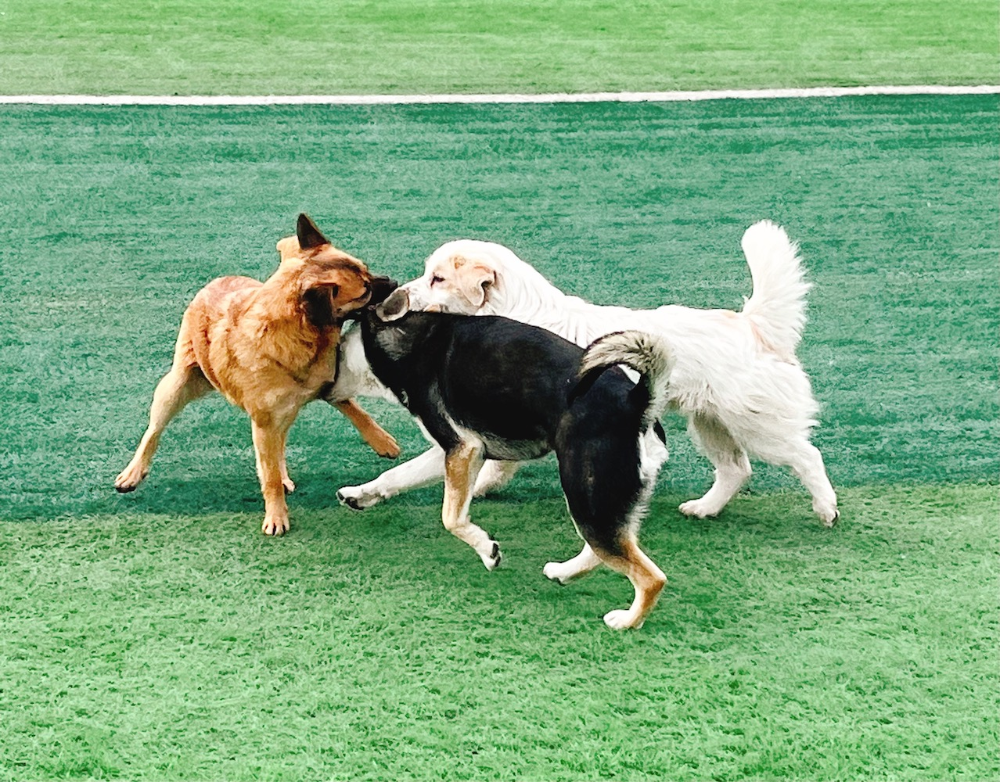
 
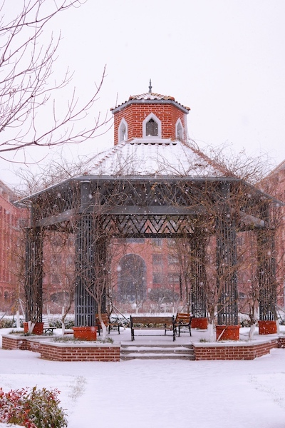
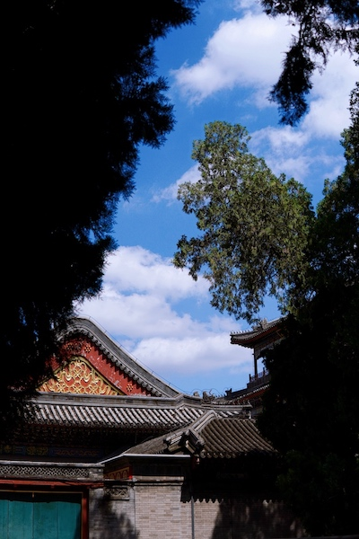

<!-- #### Talks

- Invited talk: **Recent advance in transfer learning**, at Jiqizhixin. Jun. 2021.
                    [[PDF](http://jd92.wang/assets/files/l15_jiqizhixin.pdf)]  [[Video](https://www.bilibili.com/video/BV1N5411T7Sb)]
- Invited course: **Transfer learning**, at Tsinghua University. Dec. 2019. (THU's
                    advanced machine learning course for EE graduates) [[Class photo](http://jd92.wang/image/img_thu.png)]
- Invited talk: **Transfer learning: challenges and methods**, at Shandong University, Jinan, China. Oct. 2018.
- Invited talk: **Transfer learning methods**, at Shenzhen University & Harbin
                    Institute of Technology. Jun. 2018. [[PDF](http://jd92.wang/assets/files/l14_hit.pdf)] [[Video](http://cs.hrbust.edu.cn/site/newslistread.asp?lid=201862915500727130483)]
- Invited talk: **Domain adaptation in transfer learning**, at Extreme Vision, online. Dec. 14, 2017. [[PDF](http://jd92.wang/assets/files/l12_da.pdf)]  [[Video](http://mp.weixin.qq.com/s?__biz=MzI5MDUyMDIxNA==&mid=2247484940&idx=2&sn=35e64e07fde9a96afbb65dbf40a945eb&chksm=ec1febf5db6862e38d5e02ff3278c61b376932a46c5628c7d9cb1769c572bfd31819c13dd468&mpshare=1&scene=1&srcid=1219JpTNZFiNDCHsTUrUxwqy#rd)]
- Invited course: **Transfer learning**, at Leiphone, online. Nov. 4, 2017.
- Invited course: **On machine learning**, at AI Salon at Shanghai Jiao Tong University, Shanghai, China. Sep. 16, 2017. [[PDF](http://jd92.wang/assets/files/l10_mlsjtu.pdf)] [[Photo](http://jd92.wang/assets/image/20170916.jpg)]
- Invited course: **Feature engineering in machine learning**, at Zhihu Live, online. Mar. 19, 2017. [[PDF]](http://jd92.wang/assets/files/l07_zhihu_fe.pdf) [[Visit Live](https://www.zhihu.com/lives/819543866939174912)] 
- Invited course: **Machine learning starter**, at Zhihu Live, online. Dec. 22. [[PDF](http://jd92.wang/assets/files/l06_zhihu_ml.pdf)] [[Visit Live](https://www.zhihu.com/lives/792423196996546560?utm_campaign=zhihulive&utm_source=zhihucolumn&utm_medium=Livecolumn)]  -->